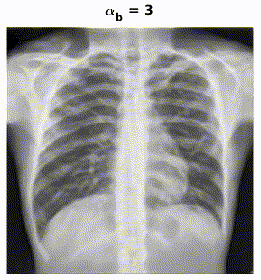

## Requirements 

```
pytorch==1.1.0
```

## Introduction 

In this study, we propose the decompose X-ray into separate components by taking advantage of the unpaired 3D knowledge from CT in the framework of generative adversarial network (GAN). The main idea of this paper is:

<br/> <div align=center></div>

Please refer to the paper for more details.

## Results

Out method disentangles different X-ray components in the latent space. It can be applied to modulating different components in X-ray images by changing the corresponding weights of probability maps in the latent space.

For example, it can be applied to bone suppression or lung enhancement by changing alpha_bone or alpha_lung:

<br />  


## Data

Please download the data and put it in `./dataset/`. We provide the processed DRR pairs and Chest X-rays (CXRs) from Shenzhen Hospital X-ray Set. Similar experiments can be easily adapated to other datasets such as ChestX-ray14 (by subtituting the CXRs from Shenzhen Hospital X-ray Set). Remember to set less training epoches for ChestX-ray14 because of much more cases (i.e. --niter 5 --niter_decay 5 --lr_decay 3).

## Test

Download the pretrained model, and put it in `./checkpoints/`. Run the script, you can modulate your CXR by chaning the alphas! For example, if we want to suppress bone region:

```
python test_DecGAN.py --dataroot ./dataset/ --name DecGAN_SZ --results_dir ./results --alpha_bone 0 --alpha_lung 1 --alpha_other 1 --gpu_ids 0
```

## Train

- You may want to track the training process by running 

```
python -m visdom.server
```

### 1. Train the decomposition network G_Dec using DRR generated from LIDC-IDRI

Because G_Dec is trained with range -1~1 but DecGAN IO implies 0~1, we should modify some preprocessing functions to train G_Dec. (I know it is dummy, it can be done better) I leave some noted in the following files:

- Comments out all the transformless related code (7 lines in total) in `./data/unaligned_dataset.py`
- Change the visualization output in `./util/util.py/tensor2im`

```
python train_G_Dec.py --dataroot ./dataset/ --name G_Dec --batchSize 20 --niter 200 --niter_decay 200 --lr_decay_iters 100 --model G_dec --gpu_ids 0
```

### 2. Train DecGAN network

- Revert the comments if you train G_Dec like above.
- Put the learned G_Dec in the checkpoints folder. It is not updated in this process. Maybe it can be trained together, but we think it is not necessary and haven't tried.
- The training can be accelerated by increasing batchsize with more gpus.

```
python train_DecGAN.py --dataroot ./dataset/ --name DecGAN_SZ --batchSize 2 --gpu_ids 0
```


## Acknowledgement
This code borrows heavily from [CycleGAN](https://github.com/junyanz/pytorch-CycleGAN-and-pix2pix) and [Unet](https://github.com/milesial/Pytorch-UNet).

## Citation
If you find our work has positively influenced your projects, please kindly consider to cite our work:

```
@article{li2020high,
  title={High-Resolution Chest X-ray Bone Suppression Using Unpaired CT Structural Priors},
  author={Li, Han and Han, Hu and Li, Zeju and Wang, Lei and Wu, Zhe and Lu, Jingjing and Zhou, S Kevin},
  journal={IEEE Transactions on Medical Imaging},
  year={2020},
  publisher={IEEE}
}
```

and

```
@inproceedings{li2019encoding,
  title={Encoding ct anatomy knowledge for unpaired chest X-Ray image decomposition},
  author={Li, Zeju and Li, Han and Han, Hu and Shi, Gonglei and Wang, Jiannan and Zhou, S Kevin},
  booktitle={International Conference on Medical Image Computing and Computer-Assisted Intervention},
  pages={275--283},
  year={2019},
  organization={Springer}
}
```
